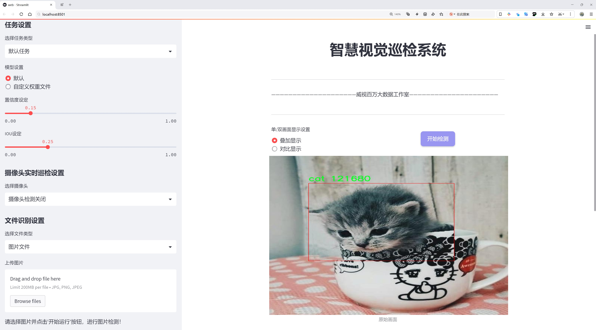
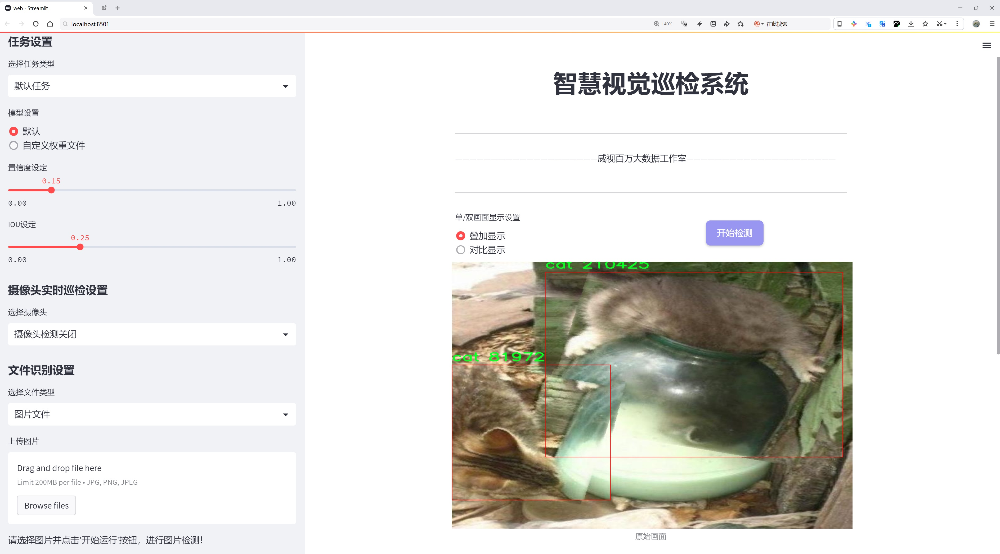
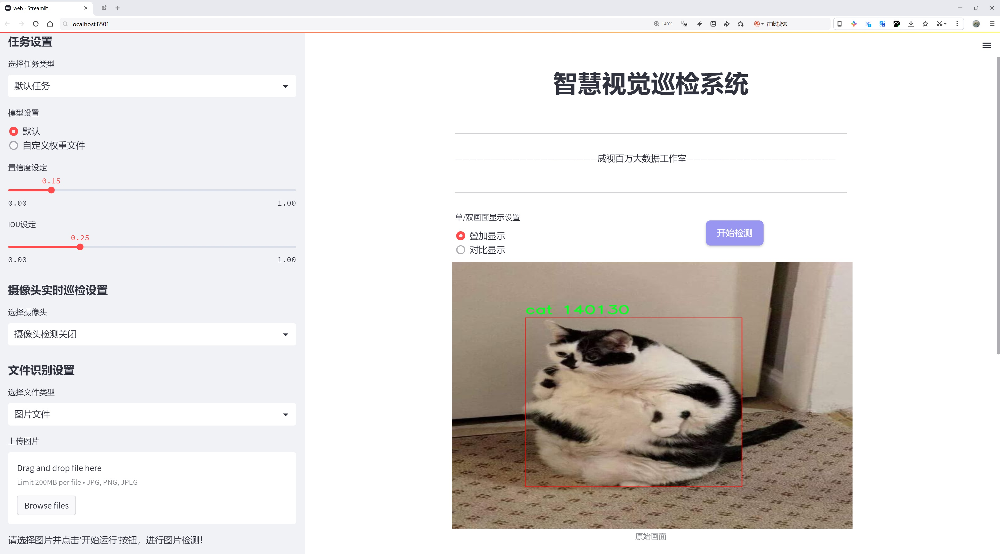
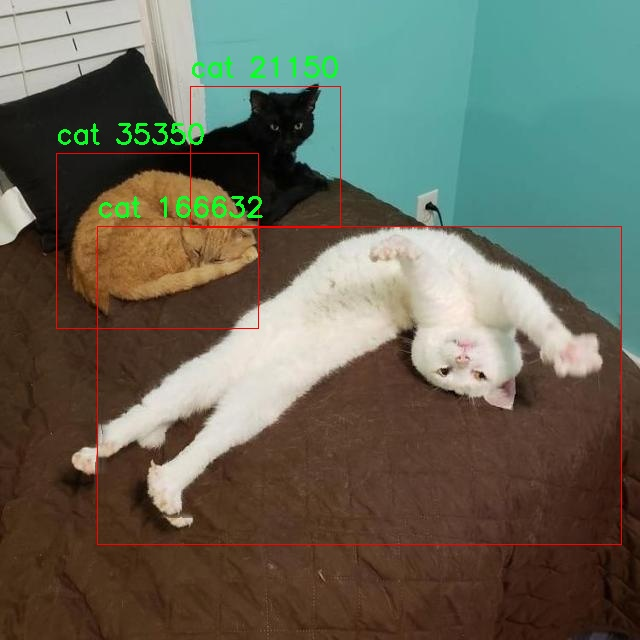
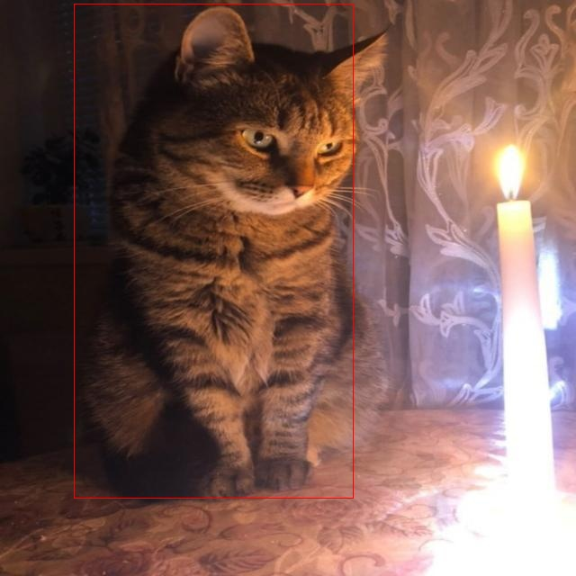
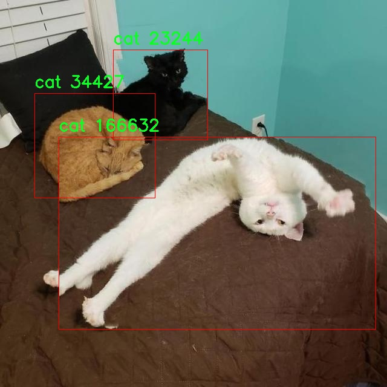
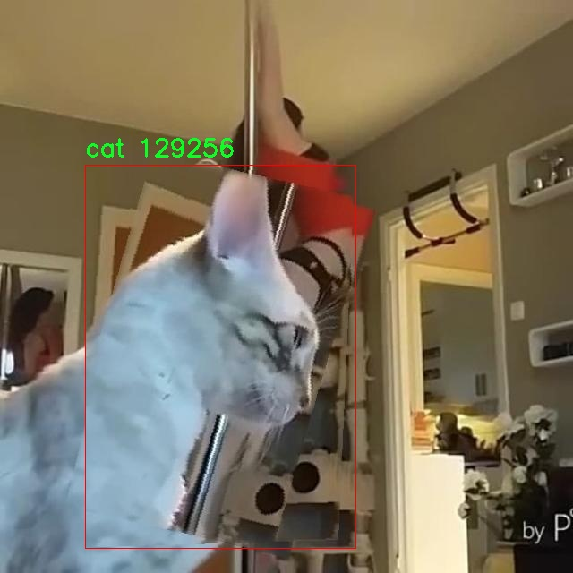
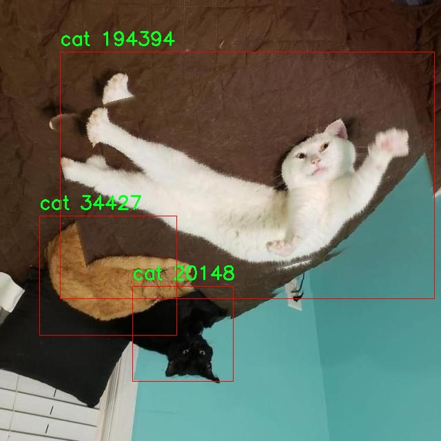

# 动物检测检测系统源码分享
 # [一条龙教学YOLOV8标注好的数据集一键训练_70+全套改进创新点发刊_Web前端展示]

### 1.研究背景与意义

项目参考[AAAI Association for the Advancement of Artificial Intelligence](https://gitee.com/qunshansj/projects)

项目来源[AACV Association for the Advancement of Computer Vision](https://gitee.com/qunmasj/projects)

研究背景与意义

随着计算机视觉技术的迅猛发展，物体检测在各个领域的应用越来越广泛，尤其是在动物检测方面。动物检测不仅对生态保护、野生动物监测、宠物管理等领域具有重要意义，同时也为人们提供了更为智能化的生活方式。近年来，YOLO（You Only Look Once）系列模型因其高效的实时检测能力而受到广泛关注，尤其是YOLOv8作为最新版本，进一步提升了检测精度和速度。因此，基于改进YOLOv8的动物检测系统的研究具有重要的理论和实践价值。

本研究所使用的数据集包含2400张图像，涵盖了三类动物：猫、狗和CAT。这一数据集的多样性为模型的训练和测试提供了丰富的样本，能够有效提高模型的泛化能力。猫和狗作为人类生活中最常见的宠物，其检测不仅有助于宠物管理和保护，也为相关产业的发展提供了数据支持。此外，数据集中包含的“CAT”类，可能代表着对特定品种或特征的识别需求，这为研究提供了更深层次的探索空间。

在当前的动物检测研究中，存在着许多挑战。例如，动物在自然环境中的姿态变化、光照条件的不同以及背景的复杂性，都会对检测效果产生影响。通过对YOLOv8模型的改进，结合数据集的特性，我们可以探索更为有效的特征提取和处理方法，从而提升模型在复杂环境下的检测性能。这不仅有助于提高动物检测的准确性，也为后续的应用研究提供了坚实的基础。

此外，动物检测系统的构建还具有广泛的社会意义。随着城市化进程的加快，流浪动物问题日益严重，基于改进YOLOv8的动物检测系统可以帮助相关机构更好地识别和管理流浪动物，推动动物保护事业的发展。同时，该系统也可以应用于宠物行业，通过对宠物行为的实时监测，提升宠物主人的管理效率，增强宠物的安全性。

综上所述，基于改进YOLOv8的动物检测系统的研究，不仅在技术上具有重要的创新意义，也在社会实践中展现出广泛的应用前景。通过对数据集的深入分析和模型的不断优化，我们期待能够为动物检测领域提供新的思路和解决方案，为生态保护和人类生活的智能化发展贡献力量。

### 2.图片演示







##### 注意：由于此博客编辑较早，上面“2.图片演示”和“3.视频演示”展示的系统图片或者视频可能为老版本，新版本在老版本的基础上升级如下：（实际效果以升级的新版本为准）

  （1）适配了YOLOV8的“目标检测”模型和“实例分割”模型，通过加载相应的权重（.pt）文件即可自适应加载模型。

  （2）支持“图片识别”、“视频识别”、“摄像头实时识别”三种识别模式。

  （3）支持“图片识别”、“视频识别”、“摄像头实时识别”三种识别结果保存导出，解决手动导出（容易卡顿出现爆内存）存在的问题，识别完自动保存结果并导出到tempDir中。

  （4）支持Web前端系统中的标题、背景图等自定义修改，后面提供修改教程。

  另外本项目提供训练的数据集和训练教程,暂不提供权重文件（best.pt）,需要您按照教程进行训练后实现图片演示和Web前端界面演示的效果。

### 3.视频演示

[3.1 视频演示](https://www.bilibili.com/video/BV1JQ44eTEzX/)

### 4.数据集信息展示

##### 4.1 本项目数据集详细数据（类别数＆类别名）

nc: 1
names: ['cat']


##### 4.2 本项目数据集信息介绍

数据集信息展示

在本研究中，我们使用了名为“CAT DETECTION”的数据集，以改进YOLOv8模型在动物检测任务中的表现。该数据集专注于猫的检测，具有独特的应用价值，尤其是在宠物监控、动物保护和野生动物研究等领域。数据集的设计旨在提供高质量的标注数据，以便训练和评估计算机视觉模型的准确性和鲁棒性。

“CAT DETECTION”数据集包含了丰富的猫的图像样本，所有样本均经过精确标注，确保模型能够学习到猫的特征和行为模式。该数据集的类别数量为1，具体类别为“cat”。这一单一类别的设置使得模型能够专注于猫的检测任务，从而提高检测的精度和效率。通过集中于一个特定类别，模型可以深入学习猫的外观特征、姿态变化和环境适应性，进而在实际应用中实现更高的检测率。

数据集中的图像来源多样，涵盖了不同品种、颜色和体型的猫，确保了模型在各种场景下的适应性。这些图像不仅包括室内环境中的猫，还包括户外场景，反映了猫在不同光照和背景条件下的表现。这种多样性对于提高模型的泛化能力至关重要，使其能够在现实世界中更有效地识别和检测猫。

在数据集的构建过程中，标注工作采用了严格的标准，确保每张图像中的猫都被准确框定。通过使用高质量的标注工具，研究团队能够提供精确的边界框和标签信息，帮助模型在训练过程中有效学习。标注的准确性直接影响到模型的性能，因此在数据集的制作中，团队投入了大量时间和精力，以确保每个样本的质量。

此外，数据集还包含了多种不同的猫的行为状态，例如静止、行走、跳跃等，这为模型的训练提供了丰富的动态信息。通过学习这些行为模式，YOLOv8模型能够更好地理解猫在不同情境下的表现，从而提高检测的准确性和实时性。这对于需要实时监控和反应的应用场景，如宠物监控摄像头，具有重要意义。

为了进一步提升模型的性能，研究团队还计划对数据集进行增强处理，包括图像旋转、缩放、裁剪和颜色调整等。这些数据增强技术将帮助模型在训练过程中接触到更多的变换情况，从而提升其在实际应用中的鲁棒性和适应性。

总之，“CAT DETECTION”数据集为改进YOLOv8的动物检测系统提供了坚实的基础。通过高质量的标注、多样化的样本和丰富的行为状态，数据集不仅为模型的训练提供了必要的数据支持，也为后续的研究和应用奠定了良好的基础。随着对该数据集的深入研究和模型的不断优化，我们期待在猫的检测任务中取得显著的进展，为相关领域的应用提供更为有效的解决方案。











### 5.全套项目环境部署视频教程（零基础手把手教学）

[5.1 环境部署教程链接（零基础手把手教学）](https://www.ixigua.com/7404473917358506534?logTag=c807d0cbc21c0ef59de5)


[5.2 安装Python虚拟环境创建和依赖库安装视频教程链接（零基础手把手教学）](https://www.ixigua.com/7404474678003106304?logTag=1f1041108cd1f708b01a)

### 6.手把手YOLOV8训练视频教程（零基础小白有手就能学会）

[6.1 手把手YOLOV8训练视频教程（零基础小白有手就能学会）](https://www.ixigua.com/7404477157818401292?logTag=d31a2dfd1983c9668658)

### 7.70+种全套YOLOV8创新点代码加载调参视频教程（一键加载写好的改进模型的配置文件）

[7.1 70+种全套YOLOV8创新点代码加载调参视频教程（一键加载写好的改进模型的配置文件）](https://www.ixigua.com/7404478314661806627?logTag=29066f8288e3f4eea3a4)

### 8.70+种全套YOLOV8创新点原理讲解（非科班也可以轻松写刊发刊，V10版本正在科研待更新）

由于篇幅限制，每个创新点的具体原理讲解就不一一展开，具体见下列网址中的创新点对应子项目的技术原理博客网址【Blog】：


[8.1 70+种全套YOLOV8创新点原理讲解链接](https://gitee.com/qunmasj/good)

### 9.系统功能展示（检测对象为举例，实际内容以本项目数据集为准）

图9.1.系统支持检测结果表格显示

  图9.2.系统支持置信度和IOU阈值手动调节

  图9.3.系统支持自定义加载权重文件best.pt(需要你通过步骤5中训练获得)

  图9.4.系统支持摄像头实时识别

  图9.5.系统支持图片识别

  图9.6.系统支持视频识别

  图9.7.系统支持识别结果文件自动保存

  图9.8.系统支持Excel导出检测结果数据


### 10.原始YOLOV8算法原理

原始YOLOv8算法原理

YOLOv8算法作为YOLO系列中的最新版本，继承并发展了前几代模型的优点，旨在提供更高效、更准确的目标检测能力。该模型的设计理念是实现实时目标检测，适应各种复杂环境下的应用需求。YOLOv8的架构主要由三个核心部分组成：Backbone、Neck和Head，这三部分相辅相成，共同完成从输入图像到目标检测结果的全过程。

在Backbone部分，YOLOv8采用了CSPDarknet（Cross Stage Partial Darknet）作为特征提取的基础网络结构。CSPDarknet通过将网络分为两个部分，每个部分包含多个残差块，显著提升了特征提取的效率和效果。与前代YOLOv5相比，YOLOv8引入了C2f模块来替代C3模块，C2f模块的设计理念是将输入特征图分为两个分支，分别经过卷积层进行降维处理。这种分支结构不仅保留了更多的特征信息，还通过堆叠多个v8_C2fBottleneck层，形成更高维度的特征图，从而实现更丰富的梯度流信息。这种创新的设计使得YOLOv8在特征提取阶段能够更有效地捕捉到图像中的重要信息，进而提高后续目标检测的准确性。

在特征提取之后，YOLOv8通过快速空间金字塔池化（SPPF）结构进一步增强了特征提取的能力。SPPF能够有效提取不同尺度的特征，适应各种目标大小的检测需求。其高效的特征提取机制不仅减少了模型的参数量和计算量，还提升了特征提取的速度和效率，为后续的目标检测提供了坚实的基础。

接下来，Neck部分采用了特征金字塔网络（FPN）和路径聚合网络（PAN）的组合结构。FPN通过多层次的特征融合，确保了不同尺度特征的有效利用，而PAN则通过上采样和下采样的方式，进一步优化了特征图的处理和压缩。这种设计不仅提高了特征图的表达能力，还为后续的目标检测提供了更为丰富的上下文信息，使得模型在复杂场景下的表现更加出色。

在目标检测的最后阶段，YOLOv8的Head部分实现了对目标的分类和定位。与传统的锚框（Anchor-based）检测方法不同，YOLOv8采用了一种无锚框（Anchor-Free）的检测方式，直接预测目标的中心点及其宽高比例。这一创新的检测策略不仅减少了对锚框的依赖，还提高了检测的速度和准确度，使得YOLOv8在处理复杂背景和小目标时表现得更加灵活和高效。

此外，YOLOv8还引入了Task-Aligned Assigner方法，通过对分类分数和回归分数的加权，优化了正样本的匹配过程。这一方法有效地提高了模型在训练过程中的样本利用率，从而提升了最终的检测性能。在损失计算方面，YOLOv8采用了二元交叉熵（BCE）计算分类损失，并结合分布焦点损失（DFL）和完整交并比（CIoU）损失函数来计算回归损失。这种多样化的损失计算方式，确保了模型在训练过程中的稳定性和准确性。

总的来说，YOLOv8算法在多个方面进行了创新和改进，使其在目标检测领域中具备了更高的精度和更快的推理速度。通过引入更为高效的特征提取结构、优化的特征融合机制以及无锚框的检测策略，YOLOv8不仅在理论上提升了目标检测的能力，更在实际应用中展现出了强大的适应性和灵活性。这些特性使得YOLOv8成为了当前业界最为流行和成功的目标检测算法之一，广泛应用于自动驾驶、安防监控、智能交通等多个领域。随着技术的不断进步，YOLOv8的潜力和应用前景将更加广阔，推动目标检测技术的进一步发展。


### 11.项目核心源码讲解（再也不用担心看不懂代码逻辑）

#### 11.1 ui.py

以下是对给定代码的核心部分进行保留和详细注释的版本：

```python
import sys
import subprocess

def run_script(script_path):
    """
    使用当前 Python 环境运行指定的脚本。

    Args:
        script_path (str): 要运行的脚本路径

    Returns:
        None
    """
    # 获取当前 Python 解释器的路径
    python_path = sys.executable

    # 构建运行命令，使用 streamlit 运行指定的脚本
    command = f'"{python_path}" -m streamlit run "{script_path}"'

    # 执行命令并等待其完成
    result = subprocess.run(command, shell=True)
    
    # 检查命令执行结果，如果返回码不为0，表示执行出错
    if result.returncode != 0:
        print("脚本运行出错。")

# 主程序入口
if __name__ == "__main__":
    # 指定要运行的脚本路径
    script_path = "web.py"  # 这里可以直接指定脚本名称

    # 调用函数运行指定的脚本
    run_script(script_path)
```

### 代码分析与注释：

1. **导入模块**：
   - `sys`：用于访问与 Python 解释器相关的变量和函数。
   - `subprocess`：用于创建新进程、连接到它们的输入/输出/错误管道，并获得返回码。

2. **`run_script` 函数**：
   - 该函数接受一个脚本路径作为参数，并在当前 Python 环境中运行该脚本。
   - 使用 `sys.executable` 获取当前 Python 解释器的路径，以确保脚本在正确的环境中运行。
   - 构建一个命令字符串，使用 `streamlit` 模块运行指定的脚本。
   - 使用 `subprocess.run` 执行构建的命令，并通过 `shell=True` 允许在 shell 中执行。
   - 检查命令的返回码，如果不为0，表示脚本运行出错，并打印错误信息。

3. **主程序入口**：
   - 通过 `if __name__ == "__main__":` 确保该代码块仅在直接运行脚本时执行，而不是在被导入时执行。
   - 指定要运行的脚本路径（这里为 `web.py`）。
   - 调用 `run_script` 函数，传入脚本路径以执行该脚本。

这样，代码的核心功能和结构得以保留，同时也提供了详细的中文注释，便于理解。

这个文件是一个 Python 脚本，主要功能是通过当前的 Python 环境运行一个指定的脚本，具体是运行一个名为 `web.py` 的文件。首先，脚本导入了必要的模块，包括 `sys`、`os` 和 `subprocess`，其中 `sys` 用于访问与 Python 解释器相关的变量和函数，`os` 用于与操作系统交互，而 `subprocess` 则用于创建新进程、连接到它们的输入/输出/错误管道，并获取它们的返回码。

在脚本中定义了一个名为 `run_script` 的函数，该函数接受一个参数 `script_path`，表示要运行的脚本的路径。函数内部首先获取当前 Python 解释器的路径，并使用这个路径构建一个命令字符串，命令的格式是使用 `streamlit` 模块来运行指定的脚本。接着，使用 `subprocess.run` 方法执行这个命令。这个方法会在一个新的 shell 中运行命令，并等待命令完成。如果命令执行的返回码不为零，表示脚本运行出错，程序会打印出错误信息。

在脚本的最后部分，使用 `if __name__ == "__main__":` 这一条件判断来确保只有在直接运行该脚本时才会执行下面的代码。在这里，指定了要运行的脚本路径为 `web.py`，并调用 `run_script` 函数来执行这个脚本。

整体来看，这个文件的主要作用是提供一个简便的方式来运行一个 Streamlit 应用（`web.py`），并处理可能出现的错误。

#### 11.2 code\ultralytics\models\yolo\pose\__init__.py

以下是代码中最核心的部分，并附上详细的中文注释：

```python
# 导入所需的模块
from .predict import PosePredictor  # 导入姿态预测器
from .train import PoseTrainer      # 导入姿态训练器
from .val import PoseValidator       # 导入姿态验证器

# 定义模块的公开接口
__all__ = "PoseTrainer", "PoseValidator", "PosePredictor"  # 指定在使用 'from module import *' 时，哪些类/函数是可用的
```

### 详细注释说明：

1. **模块导入**：
   - `from .predict import PosePredictor`：从当前包的 `predict` 模块中导入 `PosePredictor` 类，负责进行姿态预测的功能。
   - `from .train import PoseTrainer`：从当前包的 `train` 模块中导入 `PoseTrainer` 类，负责训练模型的功能。
   - `from .val import PoseValidator`：从当前包的 `val` 模块中导入 `PoseValidator` 类，负责验证模型性能的功能。

2. **公开接口定义**：
   - `__all__` 是一个特殊变量，用于定义在使用 `from module import *` 时，哪些名称是可以被导入的。在这里，指定了 `PoseTrainer`、`PoseValidator` 和 `PosePredictor` 这三个类为模块的公开接口，意味着用户可以直接使用这三个类，而不需要知道模块内部的实现细节。

这个程序文件是Ultralytics YOLO项目中的一个初始化文件，位于`code/ultralytics/models/yolo/pose/`目录下。文件的主要功能是导入与姿态估计相关的类，并定义了模块的公共接口。

首先，文件顶部的注释表明该项目使用的是AGPL-3.0许可证，并且是Ultralytics YOLO的一部分。接下来，文件通过相对导入的方式引入了三个类：`PosePredictor`、`PoseTrainer`和`PoseValidator`。这些类分别负责姿态预测、模型训练和模型验证的功能。

最后，`__all__`变量被定义为一个元组，包含了这三个类的名称。这意味着当使用`from module import *`的方式导入该模块时，只会导入`PoseTrainer`、`PoseValidator`和`PosePredictor`这三个类，从而控制了模块的公共接口，避免不必要的内部实现被暴露给用户。

总的来说，这个文件的作用是组织和简化姿态估计相关功能的导入，使得用户在使用这个模块时更加方便。

#### 11.3 code\ultralytics\models\nas\__init__.py

以下是代码中最核心的部分，并附上详细的中文注释：

```python
# 导入必要的模块和类
from .model import NAS  # 从当前包的model模块中导入NAS类
from .predict import NASPredictor  # 从当前包的predict模块中导入NASPredictor类
from .val import NASValidator  # 从当前包的val模块中导入NASValidator类

# 定义模块的公开接口
__all__ = "NASPredictor", "NASValidator", "NAS"  # 指定在使用from module import *时，允许导入的类
```

### 注释说明：
1. **导入模块**：
   - `from .model import NAS`：从当前包的`model`模块中导入`NAS`类，`NAS`可能是一个神经网络架构或模型的定义。
   - `from .predict import NASPredictor`：从当前包的`predict`模块中导入`NASPredictor`类，`NASPredictor`可能用于对输入数据进行预测。
   - `from .val import NASValidator`：从当前包的`val`模块中导入`NASValidator`类，`NASValidator`可能用于验证模型的性能。

2. **定义公开接口**：
   - `__all__`：这是一个特殊的变量，用于定义在使用`from module import *`时，哪些名称是可以被导入的。在这里，只有`NASPredictor`、`NASValidator`和`NAS`这三个类会被导入，其他名称将不会被导入。这有助于控制模块的命名空间，避免不必要的名称冲突。

这个程序文件是一个Python模块的初始化文件，位于Ultralytics YOLO项目的`nas`子目录下。文件的开头有一行注释，表明该项目使用的是AGPL-3.0许可证，并且是Ultralytics YOLO的一部分，表明其与目标检测相关。

在文件中，首先从同一目录下导入了三个类：`NAS`、`NASPredictor`和`NASValidator`。这些类可能分别代表了一个神经架构搜索（NAS）模型、一个用于进行预测的预测器，以及一个用于验证模型性能的验证器。

最后，`__all__`变量被定义为一个元组，包含了三个类的名称。这意味着当使用`from module import *`语句导入该模块时，只会导入`NASPredictor`、`NASValidator`和`NAS`这三个类。这是一种控制模块导出内容的方式，有助于避免命名冲突和提高代码的可读性。

总体来看，这个文件的主要功能是组织和导出与神经架构搜索相关的功能模块，使得其他部分的代码可以方便地使用这些功能。

#### 11.4 70+种YOLOv8算法改进源码大全和调试加载训练教程（非必要）\ultralytics\models\__init__.py

以下是代码中最核心的部分，并附上详细的中文注释：

```python
# 导入必要的模块
from .rtdetr import RTDETR  # 从当前包中导入 RTDETR 类
from .sam import SAM        # 从当前包中导入 SAM 类
from .yolo import YOLO      # 从当前包中导入 YOLO 类

# 定义可导出的模块成员
__all__ = 'YOLO', 'RTDETR', 'SAM'  # 允许在使用 'from package import *' 时，只导入 YOLO, RTDETR 和 SAM
```

### 注释说明：
1. **模块导入**：
   - `from .rtdetr import RTDETR`：从当前包的 `rtdetr` 模块中导入 `RTDETR` 类。
   - `from .sam import SAM`：从当前包的 `sam` 模块中导入 `SAM` 类。
   - `from .yolo import YOLO`：从当前包的 `yolo` 模块中导入 `YOLO` 类。

2. **`__all__` 变量**：
   - `__all__` 是一个特殊变量，用于定义当使用 `from package import *` 语句时，哪些名称会被导入。这里定义了三个可导出的类：`YOLO`、`RTDETR` 和 `SAM`。这样可以控制模块的公共接口，避免不必要的名称冲突。

这个程序文件是Ultralytics YOLO项目的一部分，主要用于定义模型的导入和模块的结构。文件的开头包含了一个版权声明，表明该代码遵循AGPL-3.0许可证。接下来，文件通过相对导入的方式引入了三个模型：RTDETR、SAM和YOLO。这些模型分别位于同一目录下的不同文件中。

通过使用`__all__`变量，文件明确了在使用`from . import *`语句时，允许导入的公共对象。这意味着当其他模块或脚本想要导入这个包时，只会导入YOLO、RTDETR和SAM这三个模型，从而简化了导入过程，避免了不必要的命名冲突和混乱。

总的来说，这个文件的主要功能是组织和管理模型的导入，使得使用者可以方便地访问YOLO系列的不同模型。

#### 11.5 train.py

以下是代码中最核心的部分，并附上详细的中文注释：

```python
class DetectionTrainer(BaseTrainer):
    """
    DetectionTrainer类，继承自BaseTrainer类，用于基于检测模型的训练。
    """

    def build_dataset(self, img_path, mode="train", batch=None):
        """
        构建YOLO数据集。

        参数:
            img_path (str): 包含图像的文件夹路径。
            mode (str): 模式，`train`表示训练模式，`val`表示验证模式，用户可以为每种模式自定义不同的数据增强。
            batch (int, optional): 批次大小，仅用于`rect`模式。默认为None。
        """
        gs = max(int(de_parallel(self.model).stride.max() if self.model else 0), 32)
        return build_yolo_dataset(self.args, img_path, batch, self.data, mode=mode, rect=mode == "val", stride=gs)

    def get_dataloader(self, dataset_path, batch_size=16, rank=0, mode="train"):
        """构造并返回数据加载器。"""
        assert mode in ["train", "val"]  # 确保模式为训练或验证
        with torch_distributed_zero_first(rank):  # 在分布式训练中，确保数据集只初始化一次
            dataset = self.build_dataset(dataset_path, mode, batch_size)  # 构建数据集
        shuffle = mode == "train"  # 训练模式下打乱数据
        if getattr(dataset, "rect", False) and shuffle:
            LOGGER.warning("WARNING ⚠️ 'rect=True'与DataLoader的shuffle不兼容，设置shuffle=False")
            shuffle = False
        workers = self.args.workers if mode == "train" else self.args.workers * 2  # 设置工作线程数
        return build_dataloader(dataset, batch_size, workers, shuffle, rank)  # 返回数据加载器

    def preprocess_batch(self, batch):
        """对一批图像进行预处理，包括缩放和转换为浮点数。"""
        batch["img"] = batch["img"].to(self.device, non_blocking=True).float() / 255  # 将图像转移到设备并归一化
        if self.args.multi_scale:  # 如果启用多尺度训练
            imgs = batch["img"]
            sz = (
                random.randrange(self.args.imgsz * 0.5, self.args.imgsz * 1.5 + self.stride)
                // self.stride
                * self.stride
            )  # 随机选择一个新的尺寸
            sf = sz / max(imgs.shape[2:])  # 计算缩放因子
            if sf != 1:  # 如果缩放因子不为1
                ns = [
                    math.ceil(x * sf / self.stride) * self.stride for x in imgs.shape[2:]
                ]  # 计算新的形状
                imgs = nn.functional.interpolate(imgs, size=ns, mode="bilinear", align_corners=False)  # 进行插值
            batch["img"] = imgs  # 更新批次中的图像
        return batch

    def get_model(self, cfg=None, weights=None, verbose=True):
        """返回一个YOLO检测模型。"""
        model = DetectionModel(cfg, nc=self.data["nc"], verbose=verbose and RANK == -1)  # 创建检测模型
        if weights:
            model.load(weights)  # 加载权重
        return model

    def get_validator(self):
        """返回用于YOLO模型验证的DetectionValidator。"""
        self.loss_names = "box_loss", "cls_loss", "dfl_loss"  # 定义损失名称
        return yolo.detect.DetectionValidator(
            self.test_loader, save_dir=self.save_dir, args=copy(self.args), _callbacks=self.callbacks
        )  # 返回验证器

    def plot_training_samples(self, batch, ni):
        """绘制带有注释的训练样本。"""
        plot_images(
            images=batch["img"],
            batch_idx=batch["batch_idx"],
            cls=batch["cls"].squeeze(-1),
            bboxes=batch["bboxes"],
            paths=batch["im_file"],
            fname=self.save_dir / f"train_batch{ni}.jpg",
            on_plot=self.on_plot,
        )  # 绘制图像

    def plot_metrics(self):
        """从CSV文件中绘制指标。"""
        plot_results(file=self.csv, on_plot=self.on_plot)  # 保存结果图像
```

### 代码核心部分说明：
1. **DetectionTrainer类**：用于训练YOLO检测模型的核心类，继承自BaseTrainer。
2. **build_dataset方法**：根据给定的图像路径和模式构建YOLO数据集。
3. **get_dataloader方法**：构造数据加载器，负责加载训练或验证数据。
4. **preprocess_batch方法**：对输入的图像批次进行预处理，包括归一化和可能的多尺度调整。
5. **get_model方法**：创建并返回YOLO检测模型，支持加载预训练权重。
6. **get_validator方法**：返回用于模型验证的检测验证器。
7. **plot_training_samples和plot_metrics方法**：用于可视化训练样本和训练过程中的指标。

这个程序文件 `train.py` 是一个用于训练 YOLO（You Only Look Once）目标检测模型的脚本，继承自 `BaseTrainer` 类。它包含了多个方法，用于构建数据集、获取数据加载器、预处理图像批次、设置模型属性、获取模型、进行验证、记录损失、显示训练进度、绘制训练样本和绘制训练指标等。

在 `DetectionTrainer` 类中，`build_dataset` 方法用于构建 YOLO 数据集，接收图像路径、模式（训练或验证）和批次大小作为参数。它会根据模型的步幅计算合适的图像大小，并调用 `build_yolo_dataset` 函数来生成数据集。

`get_dataloader` 方法则用于构建并返回数据加载器，确保在分布式训练时只初始化一次数据集。它根据模式决定是否打乱数据，并设置工作线程的数量。

`preprocess_batch` 方法负责对图像批次进行预处理，包括将图像缩放到适当的大小并转换为浮点数。它还支持多尺度训练，随机选择图像的大小进行训练。

`set_model_attributes` 方法用于设置模型的属性，包括类别数量和类别名称等，以确保模型能够正确处理训练数据。

`get_model` 方法返回一个 YOLO 检测模型，支持加载预训练权重。

`get_validator` 方法返回一个用于验证模型的 `DetectionValidator`，用于在训练过程中评估模型的性能。

`label_loss_items` 方法用于返回带有标签的训练损失项字典，方便记录和分析训练过程中的损失。

`progress_string` 方法返回一个格式化的字符串，显示训练进度，包括当前的轮次、GPU 内存使用情况、损失值、实例数量和图像大小等信息。

`plot_training_samples` 方法用于绘制训练样本及其标注，帮助可视化训练数据的质量。

最后，`plot_metrics` 和 `plot_training_labels` 方法分别用于绘制训练过程中的指标和创建带标签的训练图，帮助用户更好地理解模型的训练效果和数据分布。

整体而言，这个文件实现了 YOLO 模型训练的各个环节，涵盖了数据处理、模型训练、验证和结果可视化等功能。

#### 11.6 code\ultralytics\models\sam\modules\decoders.py

以下是经过简化和注释的核心代码部分，主要保留了 `MaskDecoder` 类及其关键方法，同时对每个部分进行了详细的中文注释。

```python
import torch
from torch import nn
from torch.nn import functional as F
from ultralytics.nn.modules import LayerNorm2d

class MaskDecoder(nn.Module):
    """
    MaskDecoder 类用于生成掩码及其质量评分，使用变换器架构根据图像和提示嵌入预测掩码。
    """

    def __init__(self, transformer_dim: int, transformer: nn.Module, num_multimask_outputs: int = 3) -> None:
        """
        初始化 MaskDecoder。

        参数:
            transformer_dim (int): 变换器模块的通道维度
            transformer (nn.Module): 用于预测掩码的变换器
            num_multimask_outputs (int): 预测的掩码数量
        """
        super().__init__()
        self.transformer_dim = transformer_dim  # 变换器的通道维度
        self.transformer = transformer  # 变换器模块

        self.num_multimask_outputs = num_multimask_outputs  # 多掩码输出数量

        # IoU 令牌嵌入
        self.iou_token = nn.Embedding(1, transformer_dim)
        # 掩码令牌的数量
        self.num_mask_tokens = num_multimask_outputs + 1
        # 掩码令牌嵌入
        self.mask_tokens = nn.Embedding(self.num_mask_tokens, transformer_dim)

        # 输出上采样网络
        self.output_upscaling = nn.Sequential(
            nn.ConvTranspose2d(transformer_dim, transformer_dim // 4, kernel_size=2, stride=2),
            LayerNorm2d(transformer_dim // 4),
            nn.GELU(),
            nn.ConvTranspose2d(transformer_dim // 4, transformer_dim // 8, kernel_size=2, stride=2),
            nn.GELU(),
        )

        # 用于生成掩码的超网络 MLP
        self.output_hypernetworks_mlps = nn.ModuleList(
            [MLP(transformer_dim, transformer_dim, transformer_dim // 8, 3) for _ in range(self.num_mask_tokens)]
        )

        # 预测掩码质量的 MLP
        self.iou_prediction_head = MLP(transformer_dim, 256, self.num_mask_tokens, 3)

    def forward(self, image_embeddings: torch.Tensor, sparse_prompt_embeddings: torch.Tensor, multimask_output: bool) -> Tuple[torch.Tensor, torch.Tensor]:
        """
        根据图像和提示嵌入预测掩码。

        参数:
            image_embeddings (torch.Tensor): 图像编码器的嵌入
            sparse_prompt_embeddings (torch.Tensor): 稀疏提示的嵌入
            multimask_output (bool): 是否返回多个掩码

        返回:
            torch.Tensor: 预测的掩码
            torch.Tensor: 掩码质量的预测
        """
        masks, iou_pred = self.predict_masks(image_embeddings, sparse_prompt_embeddings)

        # 根据是否需要多个掩码选择输出
        mask_slice = slice(1, None) if multimask_output else slice(0, 1)
        masks = masks[:, mask_slice, :, :]
        iou_pred = iou_pred[:, mask_slice]

        return masks, iou_pred

    def predict_masks(self, image_embeddings: torch.Tensor, sparse_prompt_embeddings: torch.Tensor) -> Tuple[torch.Tensor, torch.Tensor]:
        """
        预测掩码。

        参数:
            image_embeddings (torch.Tensor): 图像嵌入
            sparse_prompt_embeddings (torch.Tensor): 稀疏提示嵌入

        返回:
            torch.Tensor: 预测的掩码
            torch.Tensor: 掩码质量的预测
        """
        # 连接输出令牌
        output_tokens = torch.cat([self.iou_token.weight, self.mask_tokens.weight], dim=0)
        output_tokens = output_tokens.unsqueeze(0).expand(sparse_prompt_embeddings.size(0), -1, -1)
        tokens = torch.cat((output_tokens, sparse_prompt_embeddings), dim=1)

        # 扩展每个图像的数据以适应每个掩码
        src = torch.repeat_interleave(image_embeddings, tokens.shape[0], dim=0)
        src = src + sparse_prompt_embeddings
        b, c, h, w = src.shape

        # 运行变换器
        hs, src = self.transformer(src, tokens)
        iou_token_out = hs[:, 0, :]
        mask_tokens_out = hs[:, 1 : (1 + self.num_mask_tokens), :]

        # 上采样掩码嵌入并预测掩码
        src = src.transpose(1, 2).view(b, c, h, w)
        upscaled_embedding = self.output_upscaling(src)
        hyper_in_list = [
            self.output_hypernetworks_mlps[i](mask_tokens_out[:, i, :]) for i in range(self.num_mask_tokens)
        ]
        hyper_in = torch.stack(hyper_in_list, dim=1)
        masks = (hyper_in @ upscaled_embedding.view(b, c, h * w)).view(b, -1, h, w)

        # 生成掩码质量预测
        iou_pred = self.iou_prediction_head(iou_token_out)

        return masks, iou_pred

class MLP(nn.Module):
    """
    MLP（多层感知器）模型，用于处理输入特征。
    """

    def __init__(self, input_dim: int, hidden_dim: int, output_dim: int, num_layers: int) -> None:
        """
        初始化 MLP 模型。

        参数:
            input_dim (int): 输入特征的维度
            hidden_dim (int): 隐藏层的维度
            output_dim (int): 输出层的维度
            num_layers (int): 隐藏层的数量
        """
        super().__init__()
        self.layers = nn.ModuleList(nn.Linear(n, k) for n, k in zip([input_dim] + [hidden_dim] * (num_layers - 1), [hidden_dim] * (num_layers - 1) + [output_dim]))

    def forward(self, x):
        """执行前向传播并应用激活函数。"""
        for i, layer in enumerate(self.layers):
            x = F.relu(layer(x)) if i < len(self.layers) - 1 else layer(x)
        return x
```

### 代码说明
1. **MaskDecoder 类**：该类用于根据图像和提示嵌入生成掩码及其质量评分。它使用变换器架构来处理输入数据。
2. **初始化方法**：在初始化中，定义了变换器的维度、掩码令牌、IoU 令牌以及输出上采样网络等。
3. **forward 方法**：根据输入的图像嵌入和提示嵌入预测掩码，并根据 `multimask_output` 参数决定返回单个掩码还是多个掩码。
4. **predict_masks 方法**：该方法实现了掩码的具体预测过程，包括连接令牌、运行变换器和生成掩码。
5. **MLP 类**：实现了一个简单的多层感知器，用于处理输入特征并生成输出。

这个程序文件定义了一个名为 `MaskDecoder` 的类，主要用于生成图像的掩码及其质量评分。它采用了变换器（transformer）架构来根据图像和提示嵌入（prompt embeddings）预测掩码。类的构造函数中定义了一些重要的属性，包括变换器的维度、变换器模块、掩码的数量、IoU（Intersection over Union）标记的嵌入、掩码标记的嵌入、输出上采样的神经网络序列、用于生成掩码的超网络 MLP（多层感知器）以及用于预测掩码质量的 MLP。

在 `__init__` 方法中，首先调用父类的构造函数，然后初始化上述属性。`output_upscaling` 是一个由转置卷积和层归一化组成的序列，用于将输出的特征图上采样。`output_hypernetworks_mlps` 是一个包含多个 MLP 的模块列表，每个 MLP 用于生成不同的掩码。`iou_prediction_head` 是一个 MLP，用于预测掩码的质量。

`forward` 方法是类的主要功能实现，接受图像嵌入、位置编码、稀疏和密集的提示嵌入以及一个布尔值，指示是否返回多个掩码。该方法首先调用 `predict_masks` 方法来生成掩码和 IoU 预测，然后根据 `multimask_output` 的值选择合适的掩码输出。

`predict_masks` 方法实现了掩码的预测逻辑。它首先将 IoU 标记和掩码标记的嵌入进行拼接，并扩展为每个图像的多个掩码。接着，它将图像嵌入和密集提示嵌入相加，并将其输入到变换器中。变换器的输出包括 IoU 标记的输出和掩码标记的输出。然后，掩码嵌入经过上采样，并通过超网络 MLP 生成最终的掩码。最后，使用 IoU 标记的输出通过 `iou_prediction_head` 生成掩码质量的预测。

此外，文件中还定义了一个 `MLP` 类，用于构建多层感知器模型。该类的构造函数接受输入维度、隐藏层维度、输出维度和层数，并根据这些参数构建网络层。在 `forward` 方法中，依次通过每一层，并在最后一层应用激活函数（如果需要的话）。

总体来说，这个文件实现了一个基于变换器的掩码解码器，能够有效地从图像和提示中生成高质量的掩码，并评估其质量。

### 12.系统整体结构（节选）

### 整体功能和构架概括

该项目是一个基于YOLO（You Only Look Once）架构的目标检测和分割模型的实现，主要用于计算机视觉任务。项目的整体结构包括多个模块和子模块，涵盖了模型的训练、推理、数据处理、可视化等功能。具体功能包括：

- **模型定义与初始化**：提供不同类型的YOLO模型（如姿态估计、神经架构搜索等）的初始化和导入。
- **训练与验证**：实现训练过程中的数据加载、模型训练、损失计算和验证功能。
- **解码与掩码生成**：实现掩码解码器，能够根据输入图像和提示生成高质量的掩码。
- **工具与回调**：提供各种工具函数和回调机制，以便于训练过程中的监控和管理。

### 文件功能整理表

| 文件路径                                                                                                   | 功能描述                                                   |
|------------------------------------------------------------------------------------------------------------|------------------------------------------------------------|
| `D:\tools\20240809\code\ui.py`                                                                             | 提供一个接口以运行指定的Streamlit应用（`web.py`）。       |
| `D:\tools\20240809\code\code\ultralytics\models\yolo\pose\__init__.py`                                   | 导入与姿态估计相关的类（`PosePredictor`、`PoseTrainer`、`PoseValidator`）。 |
| `D:\tools\20240809\code\code\ultralytics\models\nas\__init__.py`                                        | 导入与神经架构搜索相关的类（`NAS`、`NASPredictor`、`NASValidator`）。 |
| `D:\tools\20240809\code\70+种YOLOv8算法改进源码大全和调试加载训练教程（非必要）\ultralytics\models\__init__.py` | 导入YOLO、RTDETR和SAM模型，简化模型的访问。               |
| `D:\tools\20240809\code\train.py`                                                                          | 实现YOLO模型的训练过程，包括数据集构建、模型训练和验证。  |
| `D:\tools\20240809\code\code\ultralytics\models\sam\modules\decoders.py`                                  | 定义掩码解码器（`MaskDecoder`），用于生成图像掩码及其质量评分。 |
| `D:\tools\20240809\code\code\ultralytics\models\yolo\segment\train.py`                                   | 处理YOLO分割模型的训练过程，具体实现未提供。               |
| `D:\tools\20240809\code\70+种YOLOv8算法改进源码大全和调试加载训练教程（非必要）\ultralytics\utils\callbacks\base.py` | 定义训练过程中的回调机制，支持模型监控和管理。            |
| `D:\tools\20240809\code\70+种YOLOv8算法改进源码大全和调试加载训练教程（非必要）\ultralytics\models\sam\model.py` | 定义SAM模型的结构和功能，具体实现未提供。                 |
| `D:\tools\20240809\code\70+种YOLOv8算法改进源码大全和调试加载训练教程（非必要）\ultralytics\models\nas\__init__.py` | 导入与神经架构搜索相关的类，功能与之前相同。              |
| `D:\tools\20240809\code\70+种YOLOv8算法改进源码大全和调试加载训练教程（非必要）\ultralytics\nn\backbone\repvit.py` | 定义RepViT模型的结构，具体实现未提供。                    |
| `D:\tools\20240809\code\code\ultralytics\utils\checks.py`                                                | 提供检查和验证功能，确保模型和数据的正确性。               |
| `D:\tools\20240809\code\code\ultralytics\trackers\basetrack.py`                                          | 实现基础的跟踪算法，支持目标检测后的跟踪功能。             |

以上表格整理了各个文件的功能，便于理解项目的整体结构和各个模块的作用。

注意：由于此博客编辑较早，上面“11.项目核心源码讲解（再也不用担心看不懂代码逻辑）”中部分代码可能会优化升级，仅供参考学习，完整“训练源码”、“Web前端界面”和“70+种创新点源码”以“13.完整训练+Web前端界面+70+种创新点源码、数据集获取”的内容为准。

### 13.完整训练+Web前端界面+70+种创新点源码、数据集获取


# [下载链接：D:\tools\20240905\Temporary](D:\tools\20240905\Temporary)